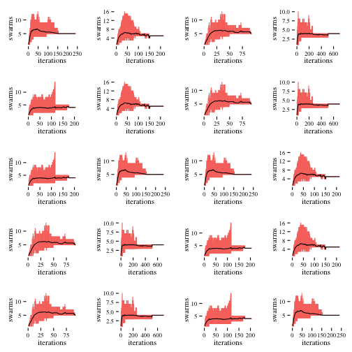

# Introduction #

```
```
In the recent years R has become the statistical programming language of choice for many people. Since its introduction in 1992. 

----

# The Algorithm #

## General Function ##

Starting point of the project was the paper provided by Jonathen E. Fieldsend [@fieldsend_2014] on the Niching Migratoy Multi-Swarm Optimiser (NMMSO) algorithm. NMMSO is a multi-modal optimiser which relies heavily on multiple swarms which are generated on the landscape of an algorithm in order to find the global optimum. It is build around three main pillars: (1) dynamic in the numbers of dimensions, (2) self-adaptive without any special preparation and (3) exploitative local search to quickly find peak estimates [@fieldsend_2014, p. 1]. 

Multi-modal optimization in general is not that different from well known and widely discussed single-objective optimisation, but in difference to it the goal of the algorithms in the multi-modal is not to find just one single optimizing point but all possible points [@fieldsend_2014, p. 1]. In order to do so, many early multi-modal optimization algorithms needed highly defined parameters [TODO: quote needed]. 

Newer algorithms fall in the field of self-tuning and try to use different mathematical paradigms like nearest-best clustering with covariance matrices [@preuss_2010] and strategies like storing the so far best found global optima estimators to provide them as parameters for new optimization runs [@epitropakis_2013]. Contradictory to that NMMSO goes another way and uses the the swarm strategy in order to find which store their current [@fieldsend_2014]

In order to do so NMMSO follow a strict structure which can be seen in the following pseudo-code
	
	nmmso(max_evals, tol, n, max_inc, c_1, c_2, chi, w)
		S: initialise_swarm(1)
		evaluations := 1
		while evaluations < max_evals:
			while flagged_swarms(S) == true:
				{S, m} := attempt_merge(S, n, tol)
				evals := evals + m
			S := increment(S, n, max_inc, c_1, c_2, chi, w)
			evals := evals + min(|S|, max_inc)
			{S, k} := attempt_separation(S, tol)
			evals := evals + k
			S := add_new_swarm(S)
			evals := evals + 1
		{X*, Y*} := extract_gebsest(S)
		return X*,Y*

## CEC ##

test

----

# The Implementation #

## Structure of the project ##

test [#fieldsend_2014]

## Pitfalls and Problems ##

test

## Benchmark and Comparison ##


 0.1   0.01   0.001   0.0001   0.00001
----  -----  ------  -------  --------
   1      1       1        1         1
   1      1       1        1         1
   1      1       1        1         1
   1      1       1        1         1
   1      1       1        1         1
   6      6       6        6         6
   7      7       7        7         7
   8      8       8        8         8
   9      9       9        9         9
  10     10      10       10        10
  11     11      11       11        11
  12     12      12       12        12
  13     13      13       13        13
  14     14      14       14        14
  15     15      15       15        15
  16     16      16       16        16
  17     17      17       17        17
  18     18      18       18        18
  19     19      19       19        19
  20     20      20       20        20


 


## Testing and alternative parameter settings ##

test

# Discussion #

test

# Conclusion #

test
\newpage
