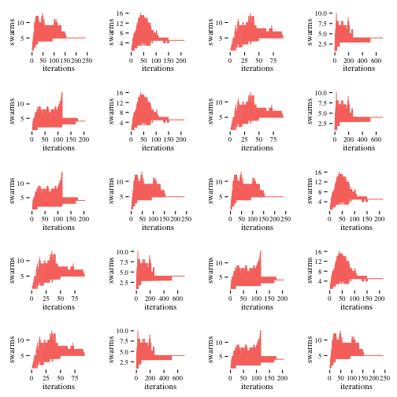

# Introduction #

In the recent years R has become the statistical programming language of choice for many scientist. The strength of R of being a domain specific language has also become one of its weaknesses. Since new research findings in statistical computing are split up over several languages like R, Matlab or SciPy[^1] it often becomes difficult to compare new methods with established ones. Since it is also hard to interface those languages due to different architectures, data storage mechanisms there is often no other way than to reimplement new methods in a different programming language to create a common scope.

An example for a well perceived new finding in statistical computing is the NMMSO-Algorithm by Jonathan E. Fieldsend [@fieldsend_2014]. It won the niching competition in 2015 held by the CEC and is only written in Matlab. Since the chair 'Information Systems and Statistics' at the Westfälische Wilhelms-Universität Münster, Germany is mainly concentrating its work on Statistical Computing in R an implementation of this algorithm became interesting. 

As part of this Seminar Project in the context of the Seminar 'Statistical Computing in R' a reimplementation of the NMMSO algorithm in R will be presented. During this technical documentation the general function of the algorithm will and the used test cases by the CEC will be shown. Afterwards the structure and used techniques and libraries, aswell as problems and pitfalls due to the different behaviors of R and Matlab will be shown. The documentation will be closed by the benchmarking results and different test cases. 

It was the goal of this project to keep up high comparability with the original code, to ensure the correct functionality and easily implement changes to the original codebase in this program. 

**… write a bit more here.**

[^1]: SciPy is a common library for the Python Programming language which brings Statistical Computing capabilities to the language.
\newpage

----

# The Algorithm #

## General Function ##

Starting point of the project was the paper provided by Jonathen E. Fieldsend [@fieldsend_2014] on the Niching Migratoy Multi-Swarm Optimiser (NMMSO) algorithm. NMMSO is a multi-modal optimiser which relies heavily on multiple swarms which are generated on the landscape of an function in order to find the global optimum. It is build around three main pillars: (1) dynamic in the numbers of dimensions, (2) self-adaptive without any special preparation and (3) exploitative local search to quickly find peak estimates [@fieldsend_2014, p. 1]. 

Multi-modal optimization in general is not that different from well known and widely discussed single-objective optimisation, but in difference to it the goal of the algorithms in the multi-modal is not to find just one single optimizing point but all possible points [@fieldsend_2014, p. 1]. In order to do so, many early multi-modal optimization algorithms needed highly defined parameters [TODO: quote needed]. 

** maybe it would be interesting to write a few more lines about the history of evalutionary algorithms here?**

Newer algorithms fall in the field of self-tuning and try to use different mathematical paradigms like nearest-best clustering with covariance matrices [@preuss_2010] and strategies like storing the so far best found global optima estimators to provide them as parameters for new optimization runs [@epitropakis_2013]. Contradictory to that NMMSO goes another way and uses the the swarm strategy in order to find which store their current [@fieldsend_2014]

In order to do so NMMSO follow a strict structure which can be seen in the following pseudo-code

	nmmso(max_evals, tol, n, max_inc, c_1, c_2, chi, w)
		S: initialise_swarm(1)
		evaluations := 1
		while evaluations < max_evals:
			while flagged_swarms(S) == true:
				{S, m} := attempt_merge(S, n, tol)
				evals := evals + m
			S := increment(S, n, max_inc, c_1, c_2, chi, w)
			evals := evals + min(|S|, max_inc)
			{S, k} := attempt_separation(S, tol)
			evals := evals + k
			S := add_new_swarm(S)
			evals := evals + 1
		{X*, Y*} := extract_gebsest(S)
		return X*,Y*

This structure wasn't modified during the reimplementation of  NMMSO to keep comparability and the possibilty to fix bugs at a high level. The only newly introduced setting was the possibility to modify the c_1, c_2, chi, w as parameters from the outside. In the original version those parameters are part of the program code.

** What else about the algorithm need to be explained that isn't explicitly part of the implementation? **

## CEC ##

test

----

# The Implementation #

## Structure of the project ##

test [#fieldsend_2014]

## Pitfalls and Problems ##

test

## Benchmark and Comparison ##

To compare the nmmsoR with the original NMMSO the CEC testcases were used to run the same benchmarks as in the original submission [@fieldsend_2014]. 

-------------------------------------------------
 &nbsp;    0.1   0.01   0.001   0.0001   0.00001 
--------- ----- ------ ------- -------- ---------
 **F1**     1     1       1       1         1    

 **F2**     1     1       1       1         1    

 **F3**     1     1       1       1         1    

 **F4**     1     1       1       1         1    

 **F5**     1     1       1       1         1    

 **F6**     0     0       0       0         0    

 **F7**     0     0       0       0         0    

 **F8**     0     0       0       0         0    

 **F9**     0     0       0       0         0    

 **F10**    0     0       0       0         0    

 **F11**    0     0       0       0         0    

 **F12**    0     0       0       0         0    

 **F13**    0     0       0       0         0    

 **F14**    0     0       0       0         0    

 **F15**    0     0       0       0         0    

 **F16**    0     0       0       0         0    

 **F17**    0     0       0       0         0    

 **F18**    0     0       0       0         0    

 **F19**    0     0       0       0         0    

 **F20**    0     0       0       0         0    
-------------------------------------------------

Table: Success Ratio over 50 runs

-------------------------------------------------
 &nbsp;    0.1   0.01   0.001   0.0001   0.00001 
--------- ----- ------ ------- -------- ---------
 **F1**   627.2 808.6   1031     1219     1406   

 **F2**   204.5 326.3    424     510       695   

 **F3**   37.16 150.1   229.4   322.5     439.2  

 **F4**   900.1  1228   1524     1813     2132   

 **F5**   74.94 169.3    364    565.6     852.8  

 **F6**     0     0       0       0         0    

 **F7**     0     0       0       0         0    

 **F8**     0     0       0       0         0    

 **F9**     0     0       0       0         0    

 **F10**    0     0       0       0         0    

 **F11**    0     0       0       0         0    

 **F12**    0     0       0       0         0    

 **F13**    0     0       0       0         0    

 **F14**    0     0       0       0         0    

 **F15**    0     0       0       0         0    

 **F16**    0     0       0       0         0    

 **F17**    0     0       0       0         0    

 **F18**    0     0       0       0         0    

 **F19**    0     0       0       0         0    

 **F20**    0     0       0       0         0    
-------------------------------------------------

Table: Convergence Rates over 50 runs

 

## Testing and alternative parameter settings ##

test

# Discussion #

test

# Conclusion #

test
\newpage
